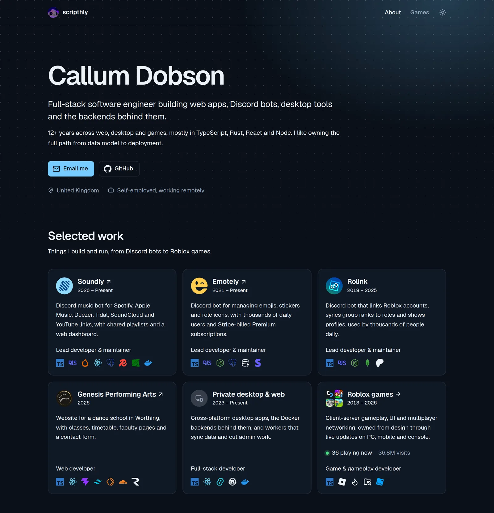

# scripthly

Source code for [scripthly.com](https://scripthly.com), the portfolio of Callum Dobson, a full-stack software engineer who builds web apps, Discord bots, desktop tools and Roblox games.



## Highlights

- **Live Roblox stats.** The games page shows visits, favourites and players online for each game. The server fetches them from the Roblox API, caches them for a minute and keeps serving the last good copy if Roblox is down.
- **One list of technologies.** Every tool shown on a project card comes from a single registry that also builds the Skills section, so the two cannot drift apart.
- **TypeScript on Node with no build step.** The server runs its source directly using Node 24's built-in type stripping.
- **Dark and light themes** with contrast-checked brand colours, served under a Content Security Policy that allows no inline scripts.
- **One Docker image**, built and published by GitHub Actions.

## Tech stack

| Area                       | Tools                                                           |
| -------------------------- | --------------------------------------------------------------- |
| Client (`apps/client`)     | React 19, Vite 8, Material UI 9, TanStack Query, React Router 8 |
| Server (`apps/server`)     | Hono on Node 24                                                 |
| Shared (`packages/shared`) | Roblox game catalogue and API types used by both apps           |
| Tooling                    | pnpm workspaces, TypeScript, ESLint, Prettier                   |
| Delivery                   | Docker, GitHub Actions, GitHub Container Registry               |

## Running it locally

You need Node 24 and pnpm. Running `corepack enable` gives you the pnpm version the repo pins.

```sh
pnpm install
pnpm dev
```

The site opens at http://localhost:3000, and Vite forwards `/api` requests to the server on port 4000.

| Command          | What it does                                                        |
| ---------------- | ------------------------------------------------------------------- |
| `pnpm dev`       | Runs the client and server with live reload                         |
| `pnpm build`     | Builds the client into `apps/client/dist`                           |
| `pnpm start`     | Serves the built site and the API on port 4000 (run `build` first) |
| `pnpm lint`      | Lints and formats the TypeScript and JavaScript                     |
| `pnpm typecheck` | Type-checks every package                                           |

No `.env` file is needed. The server reads `PORT` (default `4000`) and `LOG_LEVEL` (default `DEBUG` in development and `INFO` in production).

## API

| Endpoint                | Returns                                                     |
| ----------------------- | ----------------------------------------------------------- |
| `GET /api/health`       | `{ "status": "ok" }`, used by the container health check    |
| `GET /api/roblox/games` | Live stats for every game in the portfolio, cached for 60s |

## Deployment

Pushing a tag such as `v1.2.0` runs [`.github/workflows/docker.yml`](.github/workflows/docker.yml). It type-checks and lints the code, then builds the image and pushes it to `ghcr.io/scripthly/scripthly.com`. To run the published image:

```sh
docker compose up -d
```

This serves the site on port 4444 (set `HOST_PORT` to change it). The container runs as a non-root user and reports its health from `/api/health`.

## Project layout

```
apps/
  client/    React site: pages, components, theme and content
  server/    Hono API and static file server
packages/
  shared/    Types and data used by both apps
```

## License

The source code is released under the [MIT License](LICENSE). The site's written content, photos and artwork, including the project logos and Roblox game icons, are not covered by that license and belong to Callum Dobson or their respective owners.
